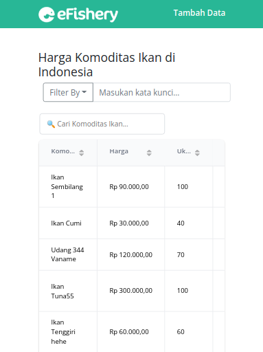
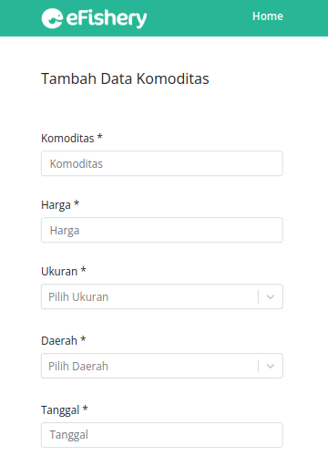
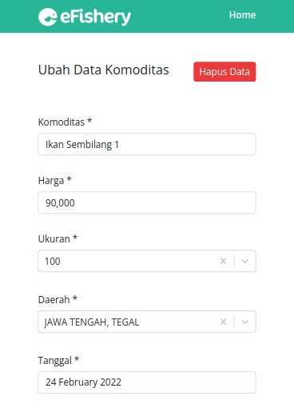

# Penjelasan Tampilan UI/Interaksi

Situs ini memiliki tiga halaman utama, yaitu:

- Halaman Home(Utama)
- Halaman Tambah Data
- Halaman Update

Alasan saya membuat tiga halaman ini terpisah adalah untuk memberikan fokus ke setiap halaman. Misalnya untuk Halaman Home, saya ingin user hanya fokus untuk melihat serta berinteraksi dengan data yang ada(seperti untuk mencari data, dsb), begitupun dengan halaman lainnya. 

## Menampilkan Data

Untuk menampilkan datanya sendiri, di sini saya memilih untuk menggunakan data table, alasannya adalah agar data dapat terlihat rapi dan mudah dipahami oleh pengguna. 

Dan juga dengan data table, maka akan memudahkan pengguna untuk mencari dan memfilter data, ditambah ada fitur pagination yang dapat memudahkan user untuk mengunjungi lokasi data yang diinginkan. Ini akan memberikan kesan bahwa pengguna dapat mengontrol data yang ingin mereka lihat.

Dimana menurut saya data seperti harga ikan ini cocok untuk ditampilkan menggunakan data table serta pagination daripada menggunakan Infinite Scroll/Load More yang lebih cocok untuk situs seperti Twitter/Facebook/dsb.

Referensi lebih lengkap:

https://uxplanet.org/ux-infinite-scrolling-vs-pagination-1030d29376f1

## Tampilan Responsive
Situs ini tidak hanya di lihat dan digunakan dengan nyaman di versi dekstop, namaun di versi mobile juga bisa digunakan dengan nyaman. Dimana data table nya dapat di geser ke samping untuk melihat bagian data lainnya.

Halaman Home

Halaman Tambah Data

Halaman Edit

## Caching Data pada Halaman

Di situs ini juga sudah dilakukan caching terhadap datanya (menggunakan React Query), yang artinya jika pengguna sudah mengunjungi suatu halaman dan melakakukan request terhadap sebuah data, maka jika pengguna kembali mengakses data/halaman tersebut, data akan di load dari cache dan tidak akan melakukan request ke server lagi.

Jadi selama datanya masih fresh dan belum stale, data akan selalu di ambil dari cache. Ini tentu secara tidak langsung akan meningkatkan pengalaman pengguna ketika mengakses suatu halaman. Dimana UX nya lebih cepat daripada harus meload data yang sama ke server lagi yang mana tentu akan memakan waktu lagi.

## Kendala

Ada sedikit kendala terkait API untuk tambah data, ketika menambahkan data, urutan data yang terisi berbeda, padahal payload sudah sesuai, misalkan data komoditas malah terisi dengan data uuid, dsb. 

